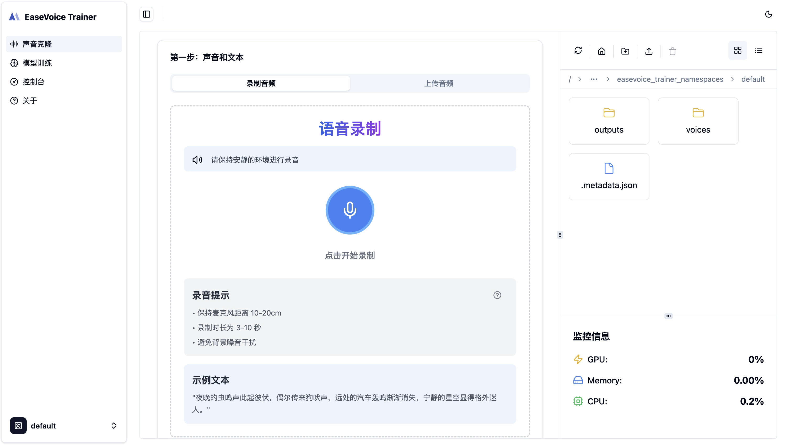
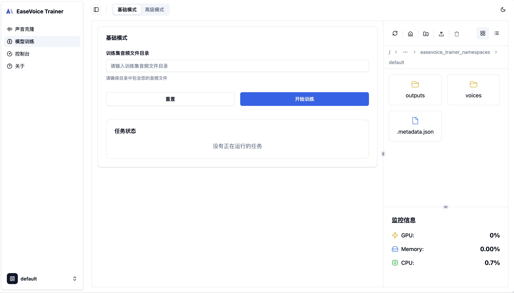
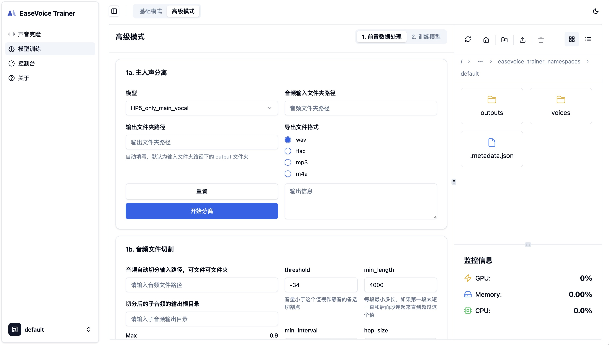
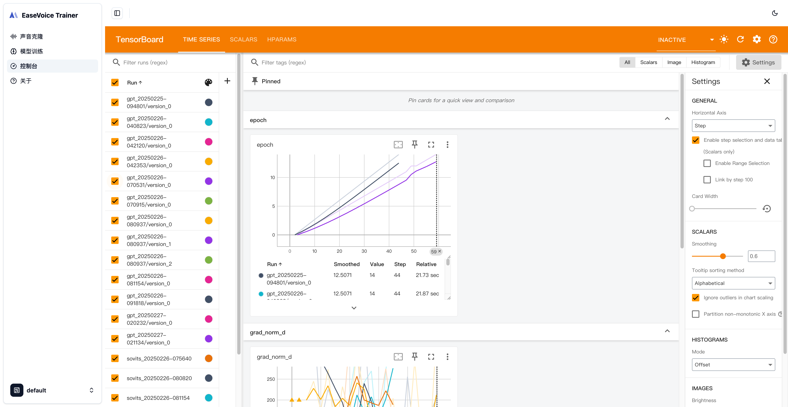

# EaseVoice Trainer

[中文文档](./README.zh-CN.md)

EaseVoice Trainer is a backend project designed to streamline and enhance the training process for voice synthesis and transformation. It is built upon the foundation of [GPT-SoVITS](https://github.com/RVC-Boss/GPT-SoVITS), inheriting its core concepts while introducing various improvements to make the system more accessible, elegant, and user-friendly.

Although EaseVoice Trainer takes inspiration from GPT-SoVITS, we chose not to directly fork the original repository due to significant design differences and unique objectives. Our focus is on creating a refined, modular system tailored to specific use cases and improving maintainability.

## Key Features

- User-Friendly Design: Simplified workflows and intuitive configurations make it easier for users to deploy and manage.
- Clean Architecture: We have split the project into separate frontend and backend repositories for better modularity and maintainability. The portal repository is at [EaseVoice Trainer Frontend](https://github.com/megaease/easevoice-trainer-portal).
- RESTful API: The backend provides a RESTful API for easy integration with other services and applications.
- Scalability: Built with scalability in mind, making it suitable for both small-scale experiments and large-scale production.
- Integrate Tensorboard: We have integrated Tensorboard for real-time monitoring and visualization of training progress.

## Screenshorts






## Getting Started

### Local Run

Before using EaseVoice Trainer, ensure you have the following installed:
 • Python 3.9 or higher
 • [uv](https://github.com/astral-sh/uv).

We leverage uv for robust and efficient project management. To start the server using uv:

```bash
uv run src/main.py
```

## Community

We welcome contributions from the community! Whether it’s fixing bugs, adding new features, or improving documentation, feel free to submit a pull request or open an issue.

## License

EaseVoice Trainer is under the Apache 2.0 license. See the [LICENSE](./LICENSE) file for details.
