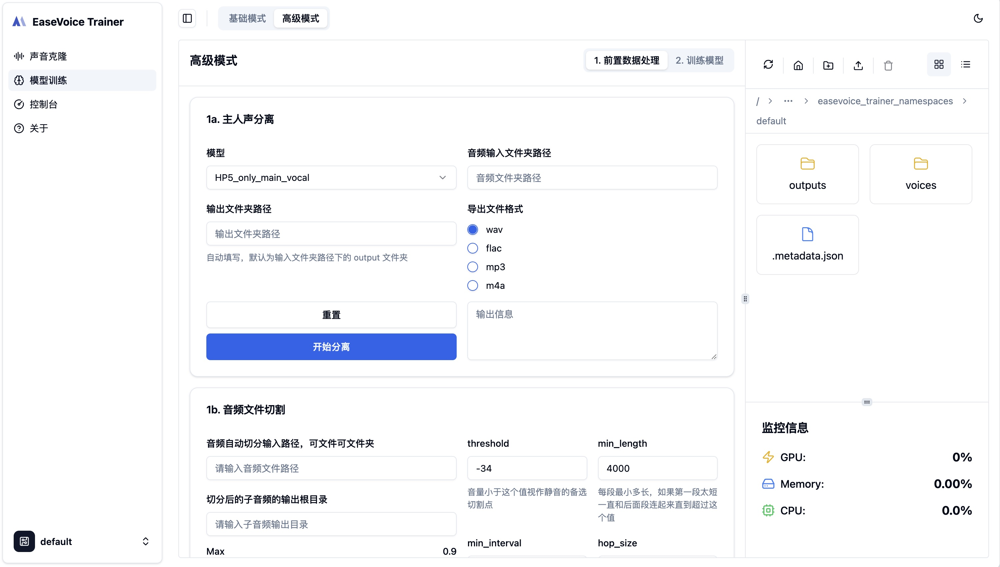
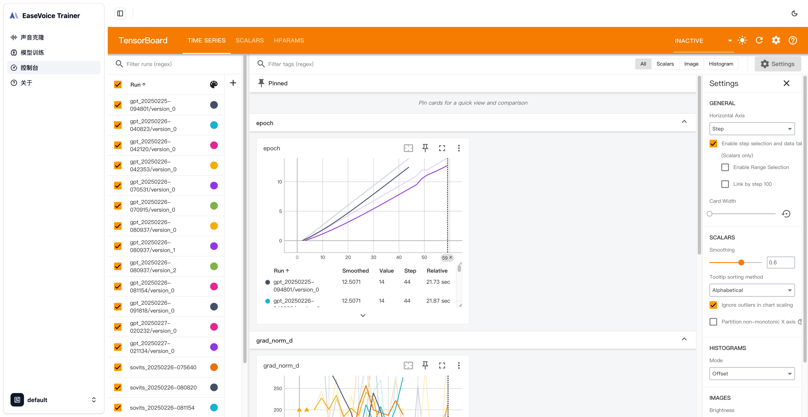

# EaseVoice Trainer

EaseVoice Trainer 是一个旨在简化和增强语音合成与转换训练过程的后端项目。它基于 [GPT-SoVITS](https://github.com/RVC-Boss/GPT-SoVITS) 的基础，继承了其核心概念，同时引入了多项改进，使系统更加易用、优雅和用户友好。

尽管 EaseVoice Trainer 受到 GPT-SoVITS 的启发，但我们选择不直接 fork 原始仓库，因为设计理念上存在较大差异，并且有独特的目标。我们的重点是创建一个精细化的、模块化的系统，专门针对特定用例，并提高可维护性。

## 主要特点

- **用户友好的设计**：简化的工作流和直观的配置，使得用户更容易进行部署和管理。
- **稳定性**：确保在整个克隆与训练过程中保持一致且可靠的表现。
- **训练可观测性**：提供全面的监控工具，清晰展示克隆与模型训练进度，及其性能指标。
- **清晰的架构**：我们将项目拆分为前端和后端两个独立的仓库，以提高模块化和可维护性。前端仓库位于 [EaseVoice Trainer Frontend](https://github.com/megaease/easevoice-trainer-portal)。
- **RESTful API**：后端提供 RESTful API，方便与其他服务和应用程序集成。
- **可扩展性**：系统设计时考虑到了可扩展性，适用于小规模实验和大规模生产。
- **集成 Tensorboard**：我们集成了 Tensorboard，用于实时监控和可视化训练进度。

## 截图





## 开始使用

### 预训练模型

与 GPT-SoVITS 一样，您从 [预训练模型](https://github.com/RVC-Boss/GPT-SoVITS/blob/main/docs/cn/README.md#%E9%A2%84%E8%AE%AD%E7%BB%83%E6%A8%A1%E5%9E%8B) ，然后将其放入 `models` 目录中。

### 本地运行

在使用 EaseVoice Trainer 之前，确保你已安装以下内容：
 • Python 3.9 或更高版本
 • [uv](https://github.com/astral-sh/uv)。

我们利用 uv 进行高效的项目管理。要使用 uv 启动服务器，请运行以下命令：

```bash
uv run src/main.py
```

### 使用 Docker 运行
1. 打包 Docker 镜像
```
cd scripts/Dockerfile
docker build -t megaease/easevoice-trainer . 
```

2. 运行 Docker 容器
```
docker run -p 8000:8000 megaease/easevoice-trainer
```

在浏览器访问 `http://localhost:8000` 即可。

## 社区

我们欢迎社区的贡献！无论是修复 bug、添加新功能，还是改进文档，都欢迎提交 pull request 或者打开 issue。

## 许可证

EaseVoice Trainer 采用 Apache 2.0 许可证。详情请参见 LICENSE 文件。
